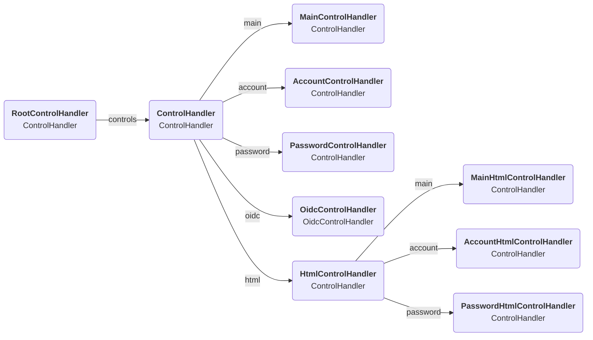

# JSON API controls

A large part of every response of the JSON API is the `controls` block.
These are generated by using nested `ControlHandler` objects.
These take as input a key/value with the values being either routes or other interaction handlers.
These will then be executed to determine the values of the output JSON object, with the same keys.
By using other `ControlHandler`s in the input map, we can create nested objects.

The default structure of these handlers is as follows:

Each of these control handlers then has a map of routes which link to the actual API endpoints.
How to add these can be seen [here](routes.md#adding-the-necessary-controls).
