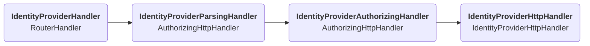
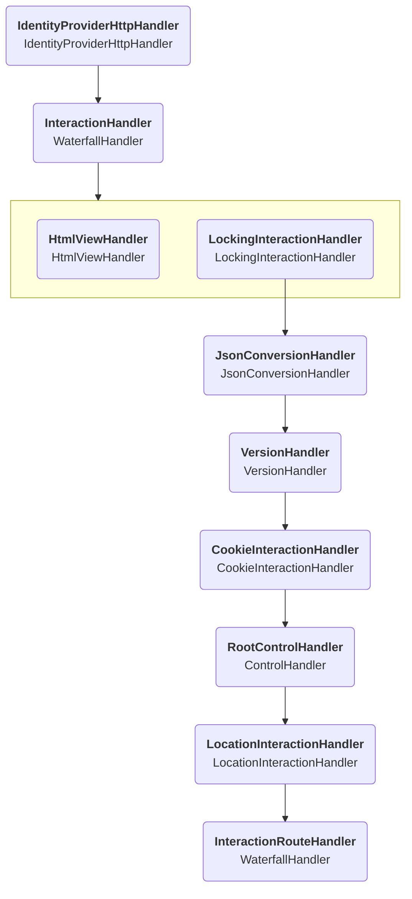

# Account management

The main entry point is the `IdentityProviderHandler`,
which routes all requests targeting a resource starting with `/.account/` into this handler,
after which it goes through similar parsing handlers as described [here](../protocol/overview.md),
the flow of which is shown below:

The `IdentityProviderHttpHandler` is where the actual differentiation of this component starts.
It handles identifying the account based on the supplied cookie and determining the active OIDC interaction,
after which it calls an `InteractionHandler` with this additional input.
The `InteractionHandler` is many handlers chained together as follows:

The `HtmlViewHandler` catches all request that request an HTML output.
This class keeps a list of HTML pages and their corresponding URL and returns them when needed.

If the request is for the JSON API,
the request goes through a chain of handlers, each responsible for a specific step in the API process.
We'll list and summarize these here:

* `LockingInteractionHandler`: In case the request is authenticated,
  this requests a lock on that account to prevent simultaneous operations on the same account.
* `JsonConversionHandler`: Converts the streaming input into a JSON object.
* `VersionHandler`: Adds a version number to all output.
* `CookieInteractionHandler`: Refreshes the cookie if necessary and adds relevant cookie metadata to the output.
* `RootControlHandler`: Responsible for adding all the [controls](controls.md) to the output.
  Will take as input multiple other control handlers which create the nested values in the `controls` field.
* `LocationInteractionHandler`: Catches redirect errors and converts them to JSON objects with a `location` field.
* `InteractionRouteHandler`: A `WaterfallHandler` containing an entry for every supported API [route](routes.md).
