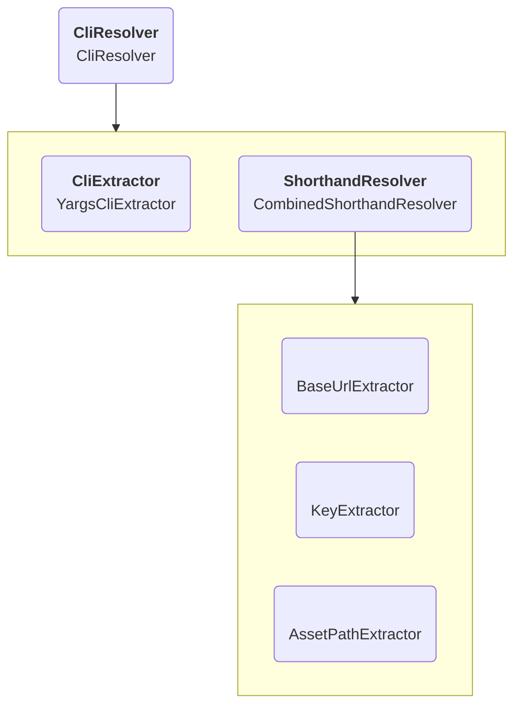

# Parsing Command line arguments

When starting the server, the application actually uses Components.js twice to instantiate components.
The first instantiation is used to parse the command line arguments.
These then get converted into Components.js variables and are used to instantiate the actual server.

## Architecture

The `CliResolver` (`urn:solid-server-app-setup:default:CliResolver`) is simply a way
to combine both the `CliExtractor` (`urn:solid-server-app-setup:default:CliExtractor`)
and `ShorthandResolver` (`urn:solid-server-app-setup:default:ShorthandResolver`)
into a single object and has no other function.

Which arguments are supported and which Components.js variables are generated
can depend on the configuration that is being used.
For example, for an HTTPS server additional arguments will be needed to specify the necessary key/cert files.

## CliResolver

The `CliResolver` converts the incoming string of arguments into a key/value object.
By default, a `YargsCliExtractor` is used, which makes use of the `yargs` library and is configured similarly.

## ShorthandResolver

The `ShorthandResolver` uses the key/value object that was generated above to generate Components.js variable bindings.
A `CombinedShorthandResolver` combines the results of multiple `ShorthandExtractor`
by mapping their values to specific variables.
For example, a `BaseUrlExtractor` will be used to extract the value for `baseUrl`,
or `port` if no `baseUrl` value is provided,
and use it to generate the value for the variable `urn:solid-server:default:variable:baseUrl`.

These extractors are also where the default values for the server are defined.
For example, BaseUrlExtractor will be instantiated with a default port of `3000`
which will be used if no port is provided.

The variables generated here will be used to [initialize the server](initialization.md).
