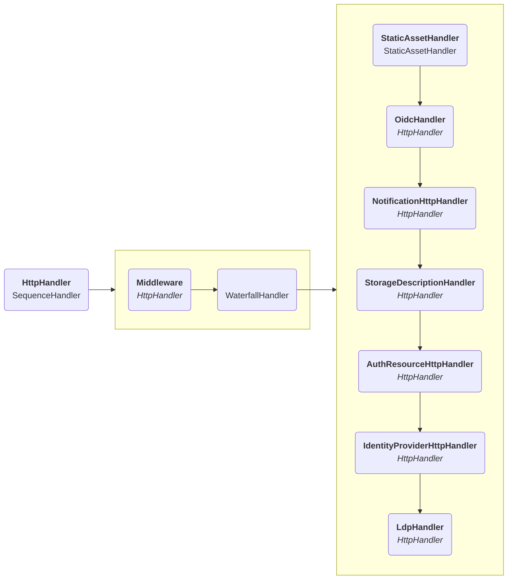

# Handling HTTP requests

The direction of the arrows was changed slightly here to make the graph readable.

The `HttpHandler` is responsible for handling an incoming HTTP request.
The request will always first go through the `Middleware`,
where certain required headers will be added such as CORS headers.

After that it will go through the list in the `WaterfallHandler`
to find the first handler that understands the request,
with the `LdpHandler` at the bottom being the catch-all default.

## StaticAssetHandler

The `urn:solid-server:default:StaticAssetHandler` matches exact URLs to static assets which require no further logic.
An example of this is the favicon, where the `/favicon.ico` URL
is directed to the favicon file at `/templates/images/favicon.ico`.
It can also map entire folders to a specific path, such as `/.well-known/css/styles/` which contains all stylesheets.

## OidcHandler

The `urn:solid-server:default:OidcHandler` handles all requests related
to the Solid-OIDC [specification](https://solid.github.io/solid-oidc/).
The OIDC component is configured to work on the `/.oidc/` subpath,
so this handler catches all those requests and sends them to the internal OIDC library that is used.

## NotificationHttpHandler

The `urn:solid-server:default:NotificationHttpHandler` catches all notification subscription requests.
By default these are requests targeting `/.notifications/`.
Which specific subscription type is targeted is then based on the next part of the URL.

## StorageDescriptionHandler

The `urn:solid-server:default:StorageDescriptionHandler` returns the relevant RDF data
for requests targeting a storage description resource.
It does this by knowing which URL suffix is used for such resources,
and verifying that the associated container is an actual storage container.

## AuthResourceHttpHandler

The `urn:solid-server:default:AuthResourceHttpHandler` is identical
to the `urn:solid-server:default:LdpHandler` which will be discussed below,
but only handles resources relevant for authorization.

In practice this means that if your server is configured
to use [Web Access Control](https://solidproject.org/TR/wac) for authorization,
this handler will catch all requests targeting `.acl` resources.

The reason these already need to be handled here is so these can also be used
to allow authorization on the following handler(s).
More on this can be found in the [identity provider](../../../usage/identity-provider/#access) documentation

## IdentityProviderHttpHandler

The `urn:solid-server:default:IdentityProviderHttpHandler` handles everything
related to our custom identity provider API, such as registering, logging in, returning the relevant HTML pages, etc.
All these requests are identified by being on the `/.account/` subpath.
More information on the API can be found in the [identity provider](../../../usage/identity-provider) documentation
The architectural overview can be found [here](accounts/overview.md).

## LdpHandler

Once a request reaches the `urn:solid-server:default:LdpHandler`,
the server assumes this is a standard Solid request according to the Solid protocol.
A detailed description of what happens then can be found [here](protocol/overview.md)
