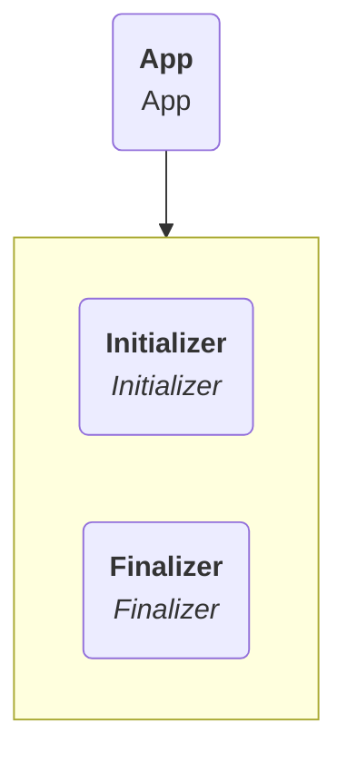
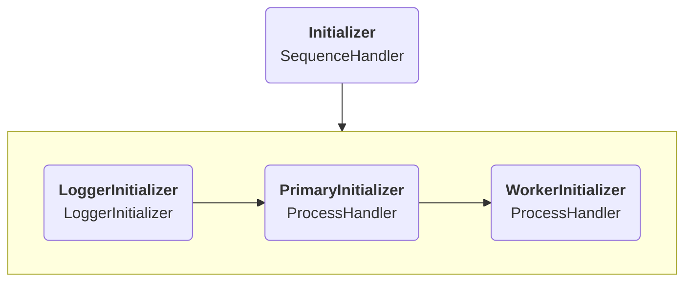
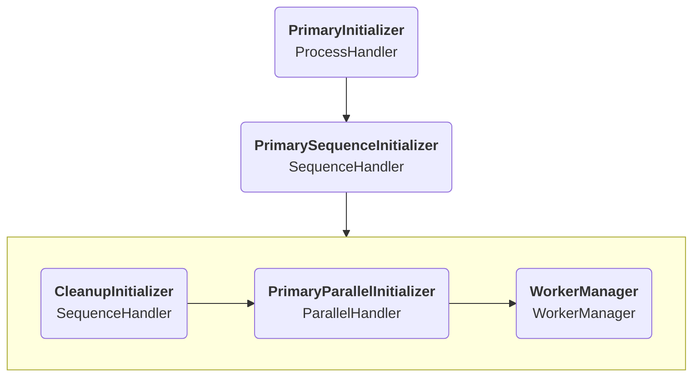
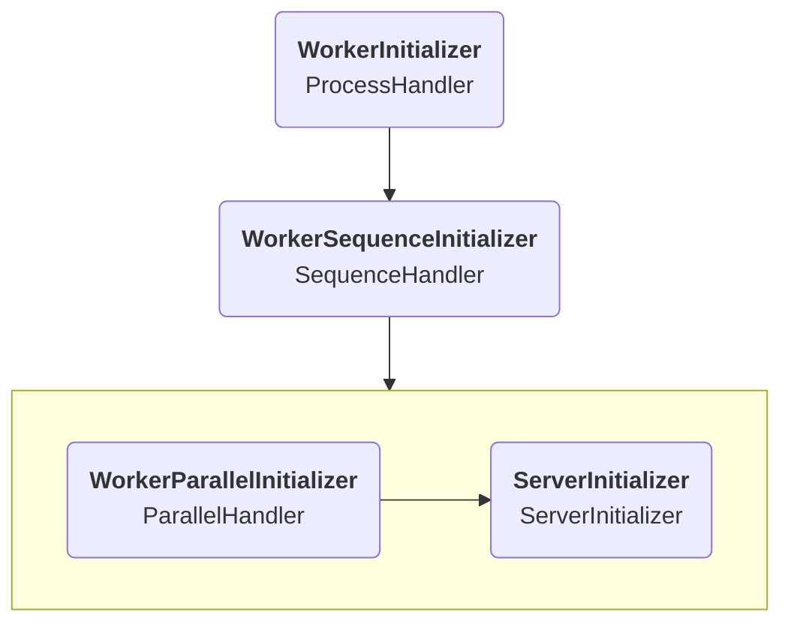
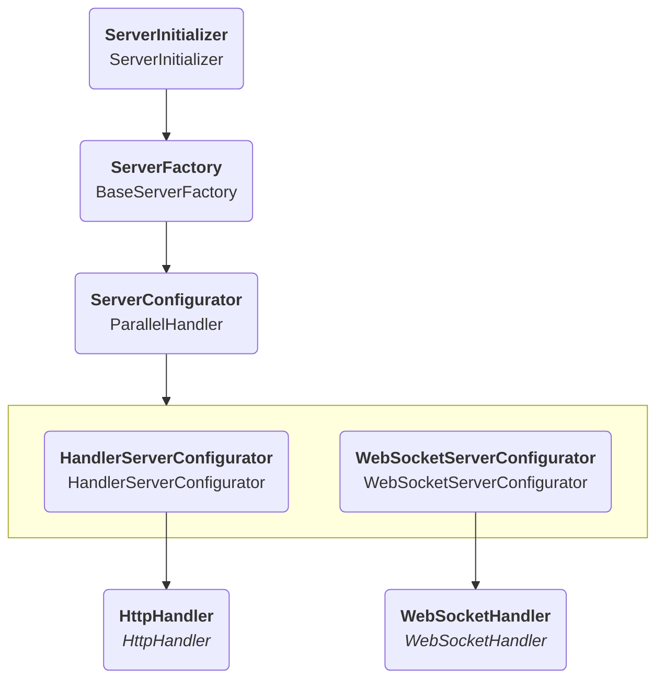

# Server initialization

When starting the server, multiple Initializers trigger to set up everything correctly,
the last one of which starts listening to the specified port.
Similarly, when stopping the server several Finalizers trigger to clean up where necessary,
although the latter only happens when starting the server through code.

## App

`App` (`urn:solid-server:default:App`) is the main component that gets instantiated by Components.js.
Every other component should be able to trace an instantiation path back to it if it also wants to be instantiated.

It's only function is to contain an `Initializer` and `Finalizer`
which get called by calling `start`/`stop` respectively.

## Initializer

The very first thing that needs to happen is initializing the logger.
Before this other classes will be unable to use logging.

The `PrimaryInitializer` will only trigger once, in the primary worker thread,
while the `WorkerInitializer` will trigger for every worker thread.
Although if your server setup is single-threaded, which is the default,
there is no relevant difference between those two.

### PrimaryInitializer

The above is a simplification of all the initializers that are present in the `PrimaryInitializer`
as there are several smaller initializers that also trigger but are less relevant here.

The `CleanupInitializer` is an initializer that cleans up anything
that might have remained from a previous server start
and could impact behaviour.
Relevant components in other parts of the configuration are responsible for adding themselves to this array if needed.
An example of this is file-based locking components which might need to remove any dangling locking files.

The `PrimaryParallelInitializer` can be used to add any initializers to that have to happen in the primary process.
This makes it easier for users to add initializers by being able to append to its handlers.

The `WorkerManager` is responsible for setting up the worker threads, if any.

### WorkerInitializer

The `WorkerInitializer` is quite similar to the `PrimaryInitializer` but triggers once per worker thread.
Like the `PrimaryParallelInitializer`, the `WorkerParallelInitializer` can be used
to add any custom initializers that need to run.

### ServerInitializer

The `ServerInitializer` is the initializer that finally starts up the server by listening to the relevant port,
once all the initialization described above is finished.
To do this it makes use of an `HttpServerFactory`.

The `HttpServerFactory` is responsible for starting a server on a given port.
Depending on the configuration this can be an HTTP or an HTTPS server.
The created server emits events when it receives requests.

Any requests it receives, it sends to its `ServerConfigurator`,
which handles the request as needed.
This is a `ParallelHandler`, supporting two kinds of requests:
HTTP requests go through a configurator that sends those
to an `HttpHandler` [to resolve HTTP requests](http-handler.md).
In case WebSockets are enabled [to handle notifications](notifications.md),
these are handled by the `WebSocketHandler`.
