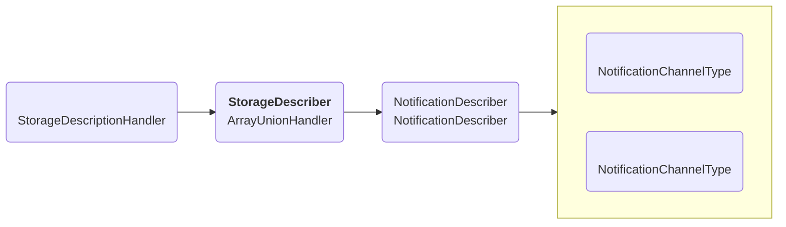
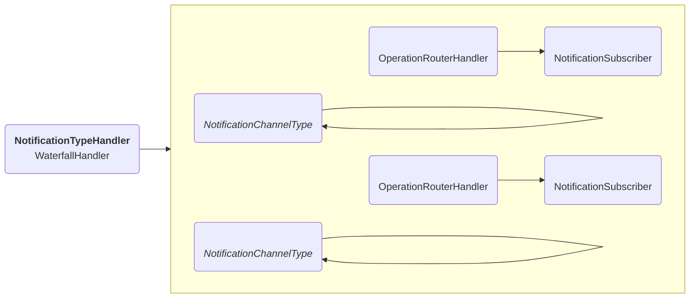
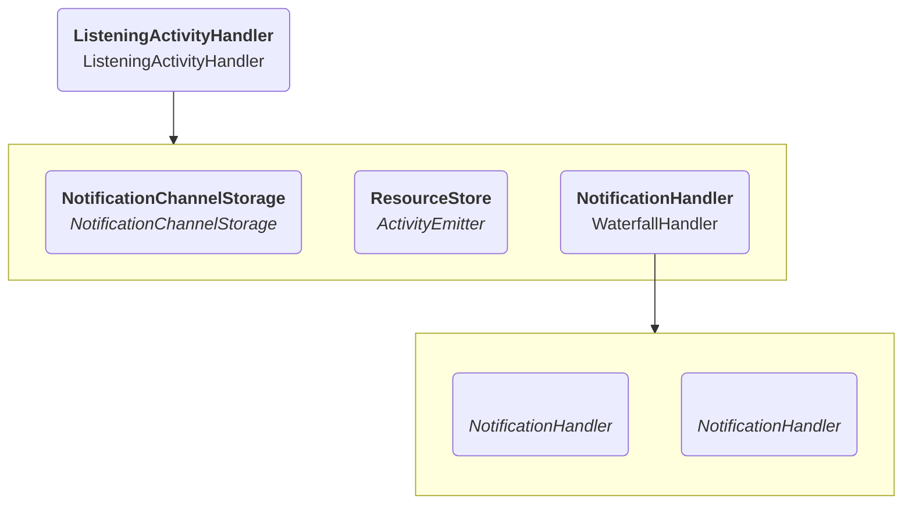
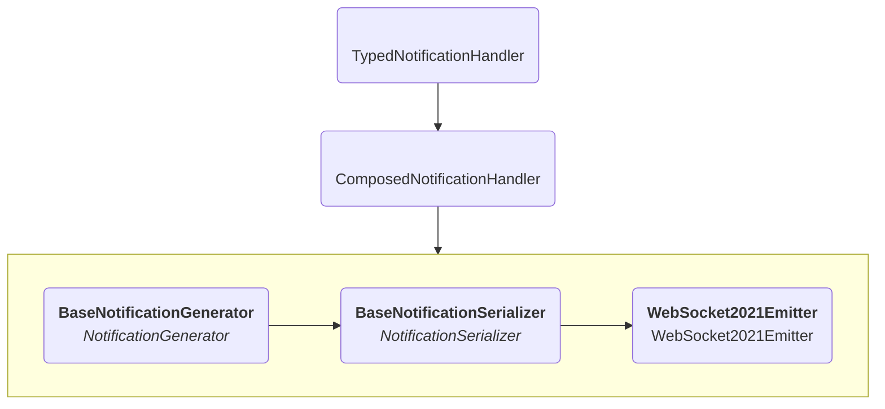

# Notifications

This section covers the architecture used to support the Notifications protocol
as described in <https://solidproject.org/TR/2022/notifications-protocol-20221231>.

There are three core architectural components, that have distinct entry points:

* Exposing metadata to allow discovery of the subscription type.
* Handling subscriptions targeting a resource.
* Emitting notifications when there is activity on a resource.

## Discovery

Discovery is done through the storage description resource(s).
The server returns the same triples for every such resource
as the notification subscription URL is always located in the root of the server.

The server uses a `StorageDescriptionHandler` to generate the necessary RDF data
and to handle content negotiation.
To generate the data we have multiple `StorageDescriber`s,
whose results get merged together in an `ArrayUnionHandler`.

A `NotificationChannelType` contains the specific details of a specification notification channel type,
including a JSON-LD representation of the corresponding subscription resource.
One specific instance of a `StorageDescriber` is a `NotificationSubcriber`,
which merges those JSON-LD descriptions into a single set of RDF quads.
When adding a new subscription type,
a new instance of such a class should be added to the `urn:solid-server:default:StorageDescriber`.

## NotificationChannel

To subscribe, a client has to send a specific JSON-LD request to the URL found during discovery.

Every subscription type should have a subscription URL relative to the root notification URL,
which in our configs is set to `/.notifications/`.
For every type there is then a `OperationRouterHandler` that accepts requests to that specific URL,
after which a `NotificationSubscriber` handles all checks related to subscribing,
for which it uses a `NotificationChannelType`.
If the subscription is valid and has authorization, the results will be saved in a `NotificationChannelStorage`.

## Activity

An `ActivityEmitter` is a class that emits events every time data changes in the server.
The `MonitoringStore` is an implementation of this in the server.
The `ListeningActivityHandler` is the class that listens to these events
and makes sure relevant notifications get sent out.

It will pull the relevant subscriptions from the storage and call the stored `NotificationHandler` for each of time.
For every subscription type, a `NotificationHandler` should be added to the `WaterfallHandler`
that handles notifications for the specific type.

## WebSocketSubscription2021

To add support for [WebSocketSubscription2021](https://solidproject.org/TR/2022/websocket-subscription-2021-20220509)
notifications,
components were added as described in the documentation above.

For discovery, a `NotificationDescriber` was added with the corresponding settings.

As `SubscriptionType`, there is a specific `WebSocketSubscription2021` that contains all the necessary information.

### Handling notifications

As `NotificationHandler`, the following architecture is used:

A `TypedNotificationHandler` is a handler that can be used to filter out subscriptions for a specific type,
making sure only WebSocketSubscription2021 subscriptions will be handled.

A `ComposedNotificationHandler` combines 3 interfaces to handle the notifications:

* A `NotificationGenerator` converts the information into a Notification object.
* A `NotificationSerializer` converts a Notification object into a serialized Representation.
* A `NotificationEmitter` takes a Representation and sends it out in a way specific to that subscription type.

`urn:solid-server:default:BaseNotificationGenerator` is a generator that fills in the default Notification template,
and also caches the result so it can be reused by multiple subscriptions.

`urn:solid-server:default:BaseNotificationSerializer` converts the Notification to a JSON-LD representation
and handles any necessary content negotiation based on the `accept` notification feature.

A `WebSocket2021Emitter` is a specific emitter that checks
whether the current open WebSockets correspond to the subscription.

### WebSockets

To detect and store WebSocket connections, the `WebSocket2021Listener` is added as a listener to the HTTP server.
For all WebSocket connections that get opened, it verifies whether they correspond to an existing subscription.
If yes, the information gets sent out to its stored `WebSocket2021Handler`.

In this case, this is a `SequenceHandler`, which contains a `WebSocket2021Storer` and a `BaseStateHandler`.
The `WebSocket2021Storer` will store the WebSocket in the same map used by the `WebSocket2021Emitter`,
so that class can emit events later on, as mentioned above.
The state handler will make sure that a notification gets sent out if the subscription has a `state` feature request,
as defined in the notification specification.

## WebHookSubscription2021

The additions required to support
[WebHookSubscription2021](https://github.com/solid/notifications/blob/main/webhook-subscription-2021.md)
are quite similar to those needed for WebSocketSubscription2021:

* For discovery, there is a `WebHookDescriber`, which is an extension of a `NotificationDescriber`.
* The `WebHookSubscription2021` class contains all the necessary typing information.
* `WebHookEmitter` is the `NotificationEmitter` that sends the request.
* `WebHookUnsubscriber` and `WebHookWebId` are additional utility classes to support the spec requirements.
