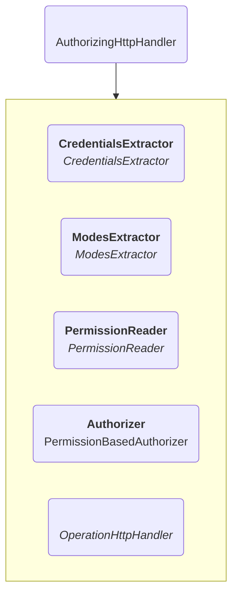
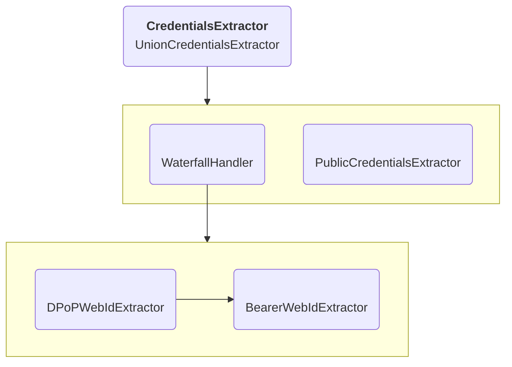
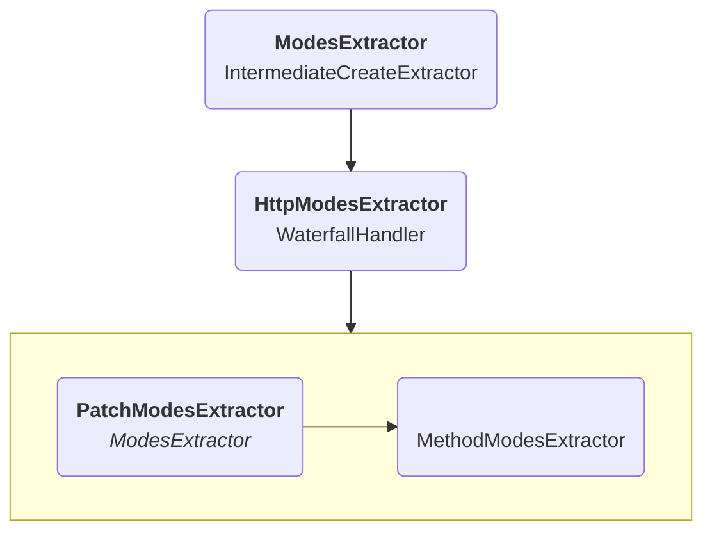
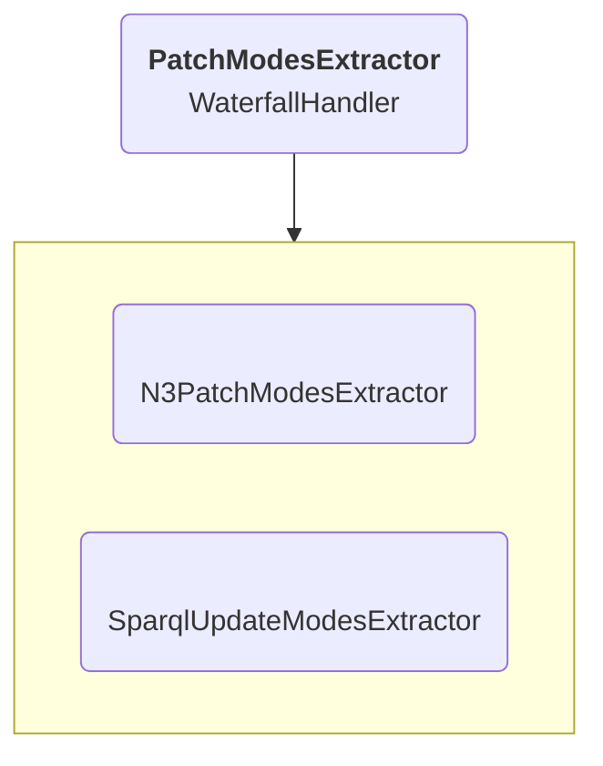
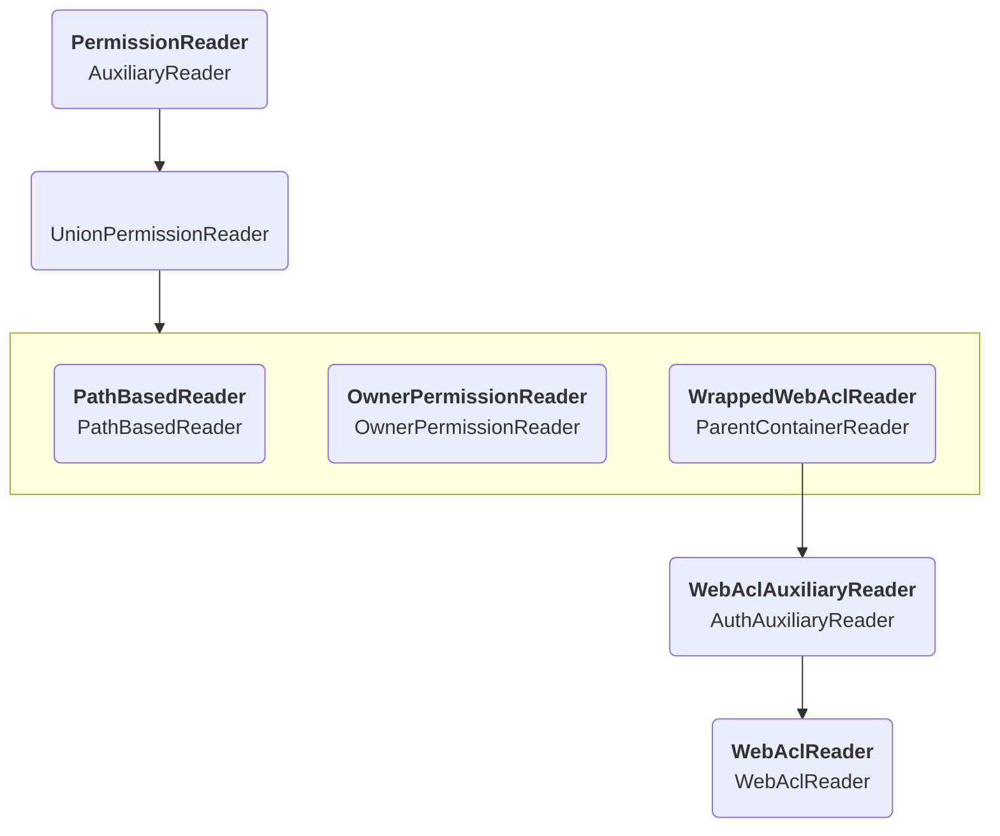

# Authorization

Authorization is usually handled by the `AuthorizingHttpHandler`,
which receives a parsed HTTP request in the form of an `Operation`.
It goes through the following steps:

1. A `CredentialsExtractor` identifies the credentials of the agent making the call.
2. A `ModesExtractor` finds which access modes are needed for which resources.
3. A `PermissionReader` determines the permissions the agent has on the targeted resources.
4. The above results are compared in an `Authorizer`.
5. If the request is allowed, call the `OperationHttpHandler`, otherwise throw an error.

## Authentication

There are multiple `CredentialsExtractor`s that each determine identity in a different way.
Potentially multiple extractors can apply,
making a requesting agent have multiple credentials.

The diagram below shows the default configuration if authentication is enabled.

Both of the WebID extractors make use of
the [`access-token-verifier`](https://github.com/CommunitySolidServer/access-token-verifier) library
to parse incoming tokens based on the [Solid-OIDC specification](https://solid.github.io/solid-oidc/).
All these credentials then get combined into a single union object.

If successful, a `CredentialsExtractor` will return an object containing all the information extracted,
such as the WebID of the agent, or the issuer of the token.

There are also debug configuration options available that can be used to simulate credentials.
These can be enabled as different options through the `config/ldp/authentication` imports.

## Modes extraction

Access modes are a predefined list of `read`, `write`, `append`, `create` and `delete`.
The `ModesExtractor` determine which modes will be necessary and for which resources,
based on the request contents.

The `IntermediateCreateExtractor` is responsible if requests try to create intermediate containers with a single request.
E.g., a PUT request to `/foo/bar/baz` should create both the `/foo/` and `/foo/bar/` containers in case they do not
exist yet.
This extractor makes sure that `create` permissions are also checked on those containers.

Modes can usually be determined based on just the HTTP methods,
which is what the `MethodModesExtractor` does.
A GET request will always need the `read` mode for example.

The only exception are PATCH requests,
where the necessary modes depend on the body and the PATCH type.

The server supports both N3 Patch and SPARQL Update PATCH requests.
In both cases it will parse the bodies to determine what the impact would be of the request and what modes it requires.

## Permission reading

`PermissionReader`s take the input of the above to determine which permissions are available.
The modes from the previous step are not yet needed,
but can be used as optimization as we only need to know if we have permission on those modes.
Each reader returns all the information it can find based on the resources and modes it receives.
In most of the default configuration the following readers are combined when WebACL is enabled as authorization method.
In case authorization is disabled by changing the authorization import to `config/ldp/authorization/allow-all.json`,
the diagram would be a single class that always returns all permissions.

The first thing that happens is that if the target is an auxiliary resource that uses the authorization of its subject resource,
the `AuxiliaryReader` inserts that identifier instead.
An example of this is if the requests targets the metadata of a resource.

The `UnionPermissionReader` then combines the results of its readers into a single permission object.
If one reader rejects a specific mode and another allows it, the rejection takes priority.

The `PathBasedReader` rejects all permissions for certain paths.
This is used to prevent access to the internal data of the server.

The `OwnerPermissionReader` makes sure owners always have control access
to the [pods they created on the server](../../../../usage/identity-provider/#pod).
Users will always be able to modify the ACL resources in their pod,
even if they accidentally removed their own access.

The final readers are specifically relevant for the WebACL algorithm.
The `ParentContainerReader` checks the permissions on a parent resource if required:
creating a resource requires `append` permissions on the parent container,
while deleting a resource requires `write` permissions there.

In case the target is an ACL resource, `control` permissions need to be checked,
no matter what mode was generated by the `ModesExtractor`.
The `AuthAuxiliaryReader` makes sure this conversion happens.

Finally, the `WebAclReader` implements
the [efffective ACL resource algorithm](https://solidproject.org/TR/2021/wac-20210711#effective-acl-resource)
and returns the permissions it finds in that resource.
In case no ACL resource is found this indicates a configuration error and no permissions will be granted.

### ACP

It is also possible to use ACP as authorization method instead of WebACL.
In that case the diagram is very similar,
except the `AuthAuxiliaryReader` is configured for Access Control Resources,
and it points to a `AcpReader` instead.

## Authorization

All the results of the previous steps then get combined in the `PermissionBasedAuthorizer` to either allow or reject a request.
If no permissions are found for a requested mode,
or they are explicitly forbidden,
a 401/403 will be returned,
depending on if the agent was logged in or not.
