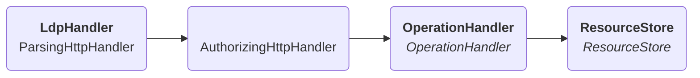

# Solid protocol

The `LdpHandler`, named as a reference to the Linked Data Platform specification,
chains several handlers together, each with their own specific purpose, to fully resolve the HTTP request.
It specifically handles Solid requests as described
in the protocol [specification](https://solidproject.org/TR/protocol),
e.g. a POST request to create a new resource.

Below is a simplified view of how these handlers are linked.

A standard request would go through the following steps:

1. The `ParsingHttphandler` parses the HTTP request into a manageable format, both body and metadata such as headers.
2. The `AuthorizingHttpHandler` verifies if the request is authorized to access the targeted resource.
3. The `OperationHandler` determines which action is required based on the HTTP method.
4. The `ResourceStore` does all the relevant data work.
5. The `ParsingHttphandler` eventually receives the response data, or an error, and handles the output.

Below are sections that go deeper into the specific steps.

* [How input gets parsed and output gets returned](parsing.md)
* [How authentication and authorization work](authorization.md)
* [What the `ResourceStore` looks like](resource-store.md)
* [How resources can be modified](patching.md)
