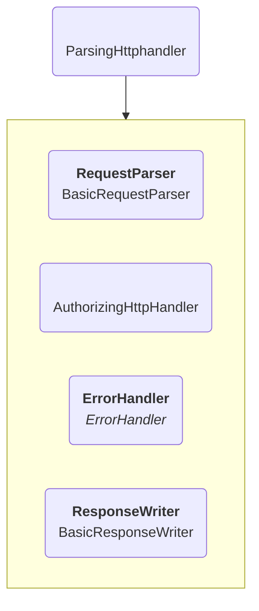
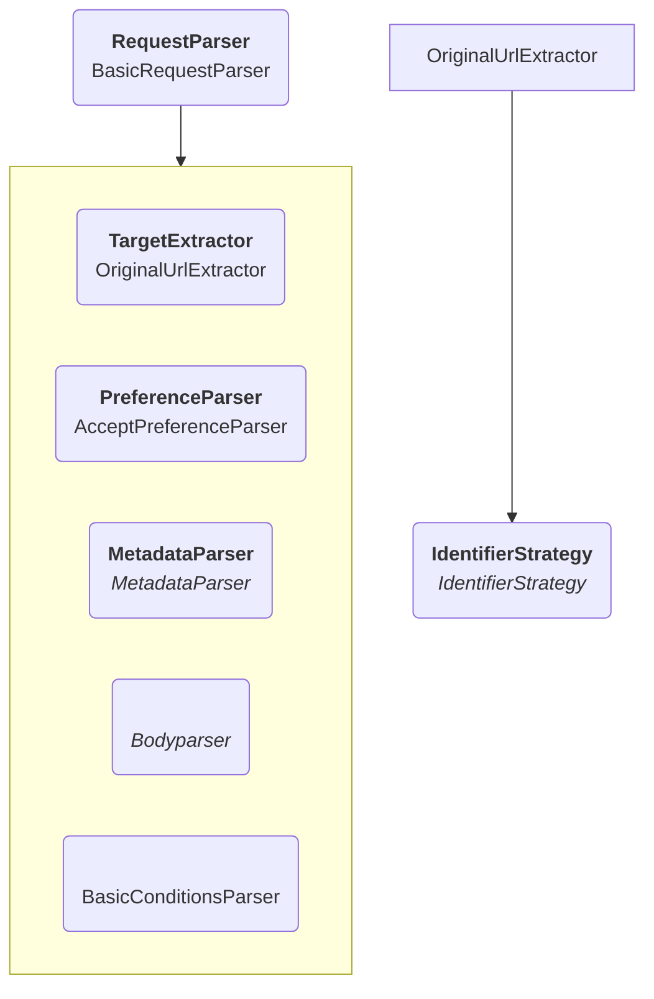

# Parsing and responding to HTTP requests

A `ParsingHttpHandler` handles both the parsing of the input data, and the serializing of the output data.
It follows these 3 steps:

1. Use the `RequestParser` to convert the incoming data into an `Operation`.
2. Send the `Operation` to the `AuthorizingHttpHandler` to receive either a `Representation` if the operation was a success,
    or an `Error` in case something went wrong.
    * In case of an error the `ErrorHandler` will convert the `Error` into a `ResponseDescription`.
3. Use the `ResponseWriter` to output the `ResponseDescription` as an HTTP response.

## Parsing the request

The `BasicRequestParser` is mostly an aggregator of multiple smaller parsers that each handle a very specific part.

### URL

This is a single class, the `OriginalUrlExtractor`, but fulfills the very important role
of making sure input URLs are handled consistently.

The query parameters will always be completely removed from the URL.

There is also an algorithm to make sure all URLs have a "canonical" version as for example both `&` and `%26`
can be interpreted in the same way.
Specifically all special characters will be encoded into their percent encoding.

The `IdentifierStrategy` it gets as input is used to determine if the resulting URL is within the scope of the server.
This can differ depending on if the server uses subdomains or not.

The resulting identifier will be stored in the `target` field of an `Operation` object.

### Preferences

The `AcceptPreferenceParser` parses the `Accept` header and all the relevant `Accept-*` headers.
These will all be put into the `preferences` field of an `Operation` object.
These will later be used to handle the content negotiation.

For example, when sending an `Accept: text/turtle; q=0.9` header,
this wil result in the preferences object `{ type: { 'text/turtle': 0.9 } }`.

### Headers

Several other headers can have relevant metadata,
such as the `Content-Type` header,
or the `Link: <http://www.w3.org/ns/ldp#Container>; rel="type"` header
which is used to indicate to the server that a request intends to create a container.

Such headers are converted to RDF triples and stored in the `RepresentationMetadata` object,
which will be part of the `body` field in the `Operation`.

The default `MetadataParser` is a `ParallelHandler` that contains several smaller parsers,
each looking at a specific header.

### Body

In case of most requests, the input data stream is used directly in the `body` field of the `Operation`,
with a few minor checks to make sure the HTTP specification is being followed.

In the case of PATCH requests though,
there are several specific body parsers that will convert the request
into a JavaScript object containing all the necessary information to execute such a PATCH.
Several validation checks will already take place there as well.

### Conditions

The `BasicConditionsParser` parses everything related to conditions headers,
such as `if-none-match` or `if-modified-since`,
and stores the relevant information in the `conditions` field of the `Operation`.
These will later be used to make sure the request should be aborted or not.

## Sending the response

In case a request is successful, the `AuthorizingHttpHandler` will return a `ResponseDescription`,
and if not it will throw an error.

In case an error gets thrown, this will be caught by the `ErrorHandler` and converted into a `ResponseDescription`.
The request preferences will be used to make sure the serialization is one that is preferred.

Either way we will have a `ResponseDescription`,
which will be sent to the `BasicResponseWriter` to convert into output headers, data and a status code.

To convert the metadata into headers, it uses a `MetadataWriter`,
which functions as the reverse of the `MetadataParser` mentioned above:
it has multiple writers which each convert certain metadata into a specific header.
