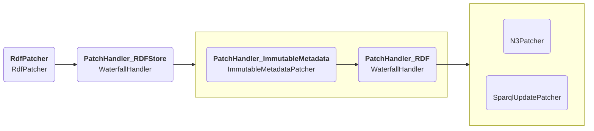

# Modifying resources

As described [here](resource-store.md#patchingstore),
there is a generic solution for modifying resources as a result of PATCH requests.
It consists of doing the following steps:

* Convert the stored resource to a quad objects stream.
* Read the quad stream and ingest them in an [N3.js Store](https://github.com/rdfjs/N3.js#storing).
* In case the target resource is metadata, ensure certain triples don't get changed.
* Apply the patch to the quad store.
* Convert the quad store to a quad stream.
* Convert the quad stream back to original content type of the resource.

The architecture is described more in-depth below.

The `PatchingStore` is the entry point.
It first checks if the [next store](resource-store.md) supports modifying resources.
Only if this is not the case will it start the generic patching solution by calling its `PatchHandler`.

The `RepresentationPatchHandler` calls the source `ResourceStore`
to get a data stream representing the current state of the resource.
It feeds that stream as input into a `RepresentationPatcher`,
and then writes the result back to the store.

Similarly to how accessing resources is done through a stack of `ResourceStore`s,
patching is doing through a stack of `RepresentationPatcher`s,
each performing a step in the patching process.

The `ConvertingPatcher` is responsible for converting the original resource to a stream of quad objects,
and converting the modified result back to the original type.
By converting to quads, all other relevant classes can act independently of the actual RDF serialization type.
For similar reasons, the `RdfPatcher` converts the quad stream to an [N3.js Store](https://github.com/rdfjs/N3.js#storing)
so the next patchers do not have to worry about handling stream data
and have access to the entire resource in memory.

The `ImmutableMetadataPatcher` keeps track of a list of triples that can not be modified
in the metadata of a resource.
For example, it is not possible to modify the metadata to indicate if it is
a [storage root](https://solidproject.org/TR/2022/protocol-20221231#storage-resource).
It tracks all these triples before and after a metadata resource is modified
and throws an error if one is modified.
In case the target resource is not metadata but a standard resource, this class will be skipped.

Finally, either the `N3Patcher` or the `SparqlUpdatePatcher` will be called,
depending on the type of patch that is requested.
