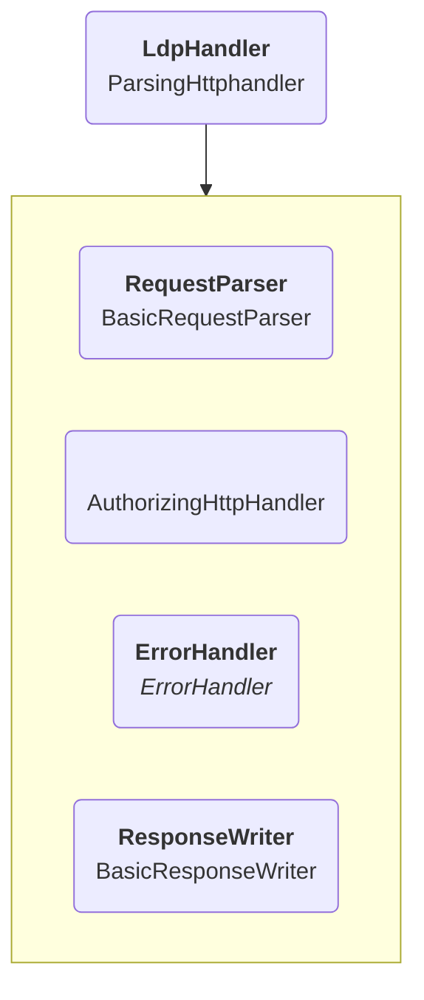

# Architecture overview

The initial architecture document the project was started from can be found
[here](https://rubenverborgh.github.io/solid-server-architecture/solid-architecture-v1-3-0.pdf).
Many things have been added since the original inception of the project,
but the core ideas within that document are still valid.

As can be seen from the architecture, an important idea is the modularity of all components.
No actual implementations are defined there, only their interfaces.
Making all the components independent of each other in such a way provides us with an enormous flexibility:
they can all be replaced by a different implementation, without impacting anything else.
This is how we can provide many different configurations for the server,
and why it is impossible to provide ready solutions for all possible combinations.

## Architecture diagrams

Having a modular architecture makes it more difficult to give a complete architecture overview.
We will limit ourselves to the more commonly used default configurations we provide,
and in certain cases we might give examples of what differences there are
based on what configurations are being imported.

To do this we will make use of architecture diagrams.
We will use an example below to explain the formatting used throughout the architecture documentation:

Below is a summary of how to interpret such diagrams:

* Rounded red box: component instantiated in the Components.js [configuration](dependency-injection.md).
    * First line:
        * **Bold text**: shorthand of the instance identifier. In case the full URI is not specified,
            it can usually be found by prepending `urn:solid-server:default:` to the shorthand identifier.
        * (empty): this instance has no identifier and is defined in the same place as its parent.
    * Second line:
        * Regular text: The class of this instance.
        * _Italic text_: The interface of this instance.
            Will be used if the actual class is not relevant for the explanation or can differ.
* Square grey box: the parameters of the linked instance.
* Arrow: links an instance to its parameters. Can also be used to indicate the order of parameters if relevant.

For example, in the above, **LdpHandler** is a shorthand for the actual identifier `urn:solid-server:default:LdpHandler`
and is an instance of `ParsingHttpHandler`. It has 4 parameters,
one of which has no identifier but is an instance of `AuthorizingHttpHandler`.

## Features

Below are the sections that go deeper into the features of the server and how those work.

* [How Command Line Arguments are parsed and used](features/cli.md)
* [How the server is initialized and started](features/initialization.md)
* [How HTTP requests are handled](features/http-handler.md)
* [How the server handles a standard Solid request](features/protocol/overview.md)
* [How Notification components are configured](features/notifications.md)
